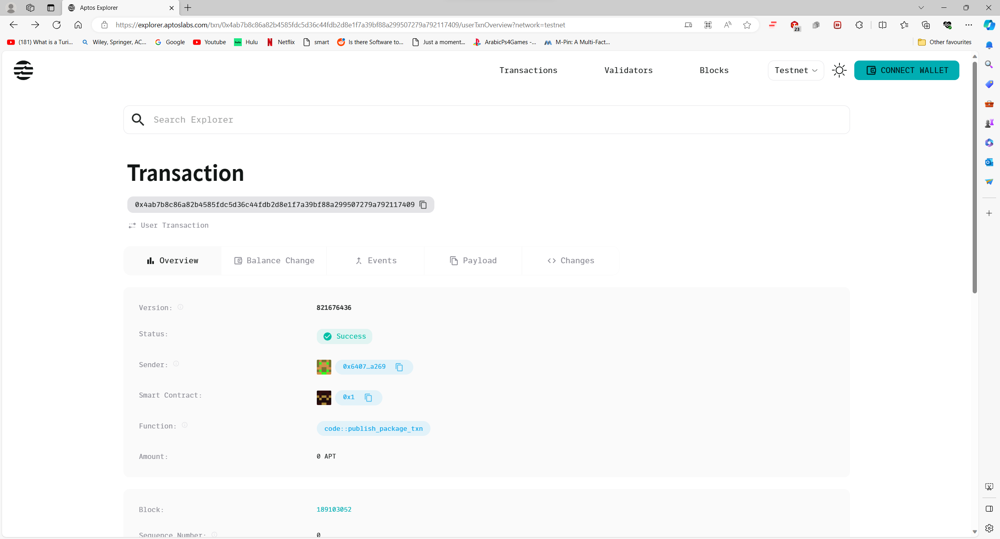
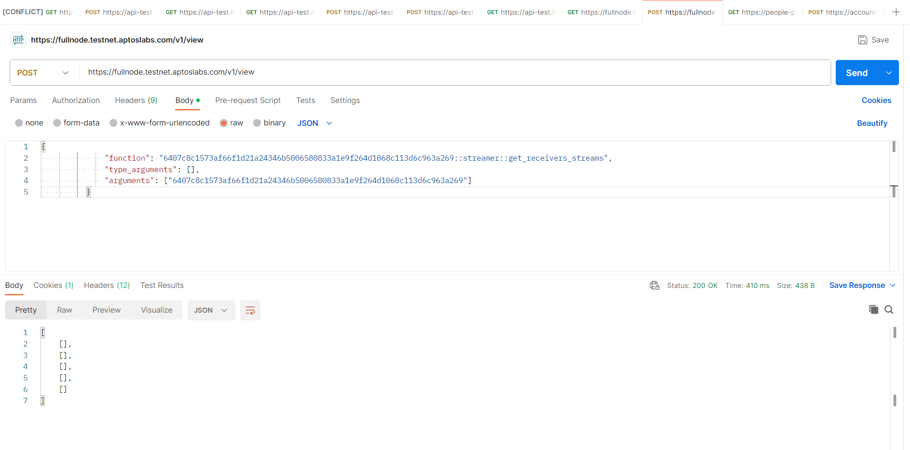

# seamlessPayments


With Aptos payments, you can send and receive payments in real-time. Utilize your potential to the fullest extent by having access to your earnings as soon as you earn them.
Claiming APT: As soon as a stream begins, the recipient has the freedom to claim the amount that has been streamed up to that point at any time they choose.

Viewing stream rate: Users involved in sending or receiving streamed payments have the ability to monitor their current stream rate, which reflects their total stream rate, taking into account all incoming and outgoing payments.

Managing streams: The platform equips users with comprehensive control over their incoming and outgoing payment streams.

Viewing stream history: Users have the option to look back at the history of each individual stream they are involved in, whether they are sending or receiving.


# First Steps 

The .env includes a deployed contract address on the aptos testnetwork so you can skip this step to the next highlighted section if you want,  but if you would like to deploy it yourself and get familiar with move on aptos, here you go:  
You need the aptos cli, you can use the following to install the cli:

`https://aptos.dev/tools/aptos-cli/install-cli/`

Run the following to initialize an aptos instance on testnet, take note of the account number returned:

```
$ aptos init
Configuring for profile default
Choose network from [devnet, testnet, mainnet, local, custom | defaults to devnet]
testnet
Enter your private key as a hex literal (0x...) [Current: None | No input: Generate new key (or keep one if present)]

No key given, generating key...
Account 0x6407c8c1573af66f1d21a24346b5006580833a1e9f264d1068c113d6c963a269 doesn't exist, creating it and funding it with 100000000 Octas
Account 0x6407c8c1573af66f1d21a24346b5006580833a1e9f264d1068c113d6c963a269 funded successfully

---
Aptos CLI is now set up for account 0x6407c8c1573af66f1d21a24346b5006580833a1e9f264d1068c113d6c963a269 as profile default!  Run `aptos --help` for more information about commands
{
  "Result": "Success"
}
```
Afterwards you should try compiling the contract before deploying, take note the address we used here should be the one from previous step:
```
$ aptos move compile --package-dir contracts --named-addresses the_streamer=0x6407c8c1573af66f1d21a24346b5006580833a1e9f264d1068c113d6c963a269
Compiling, may take a little while to download git dependencies...
INCLUDING DEPENDENCY AptosFramework
INCLUDING DEPENDENCY AptosStdlib
INCLUDING DEPENDENCY AptosTokenObjects
INCLUDING DEPENDENCY MoveStdlib
BUILDING streamer
{
  "Result": [
    "6407c8c1573af66f1d21a24346b5006580833a1e9f264d1068c113d6c963a269::streamer"
  ]
}
```
Unit Testing is always a good idea:
```
$ aptos move test --package-dir contracts --named-addresses the_streamer=0x6407c8c1573af66f1d21a24346b5006580833a1e9f264d1068c113d6c963a269
INCLUDING DEPENDENCY AptosFramework
INCLUDING DEPENDENCY AptosStdlib
INCLUDING DEPENDENCY AptosTokenObjects
INCLUDING DEPENDENCY MoveStdlib
BUILDING streamer
Running Move unit tests
Test result: OK. Total tests: 0; passed: 0; failed: 0
{
  "Result": "Success"
}
```
if all goes well you should be able to publish the contract:
```
$ aptos move publish --package-dir contracts --named-addresses the_streamer=0x6407c8c1573af66f1d21a24346b5006580833a1e9f264d1068c113d6c963a269
Compiling, may take a little while to download git dependencies...
INCLUDING DEPENDENCY AptosFramework
INCLUDING DEPENDENCY AptosStdlib
INCLUDING DEPENDENCY AptosTokenObjects
INCLUDING DEPENDENCY MoveStdlib
BUILDING streamer
package size 6850 bytes
Do you want to submit a transaction for a range of [636100 - 954100] Octas at a gas unit price of 100 Octas? [yes/no] >
yes
{
  "Result": {
    "transaction_hash": "0x4ab7b8c86a82b4585fdc5d36c44fdb2d8e1f7a39bf88a299507279a792117409",
    "gas_used": 6361,
    "gas_unit_price": 100,
    "sender": "6407c8c1573af66f1d21a24346b5006580833a1e9f264d1068c113d6c963a269",
    "sequence_number": 0,
    "success": true,
    "timestamp_us": 1703175503744315,
    "version": 821676436,
    "vm_status": "Executed successfully"
  }
}
```
you can check out your transaction in the following link, you would have to replace the transaction hash with the hash returned from the step before:
```
https://explorer.aptoslabs.com/txn/${transaction_hash}?network=testnet
```
What you should see:



Now we are sure our module was deployed to a valid testnet, but what if I we want to make sure the functions in our module are also reachable via the API, just to be extra safe you could request one of the view functions exposed through the api, don't worry about what this function does yet and the empty arrays returned by the result that is totally normal, as long as the response is 200OK we are okay.


you should revisit if the code is 400 or anything else other than 200.


now that we are done with our backend let's make sure all the values we have from before are reflected in the dapp navigate to /app/next.config.js:

and change the address to the same address we used with our aptos cli to publish to the test network:
```
const nextConfig = {
  env: {
    MODULE_ADDRESS: "0x6407c8c1573af66f1d21a24346b5006580833a1e9f264d1068c113d6c963a269", // change this
    MODULE_NAME: "streamer",
    RESOURCE_ACCOUNT_ADDRESS: "0x6407c8c1573af66f1d21a24346b5006580833a1e9f264d1068c113d6c963a269", // and this 
  }
}
```

In this contract, the admin/module deployer is used to store all of the module's resources instead of a resource account. Because of this the resource account constant is the same as the module address!


# Deploying the dapp locally:

1. Navigate to the app directory
2. Run yarn install or npm install to install dependencies
3. Run yarn dev or npm run dev to start the development server
4. Open http://localhost:3000 with your browser to see the result

The DAPP will walk you through how to use it, but the main thing to remember here is that you need a wallet (Martian or Petra) and at least two different accounts, create a payment stream between two accounts, accept payments, cancel payments, claim payments, view your payment history, keep watching your payement stream rate and enjoy :)